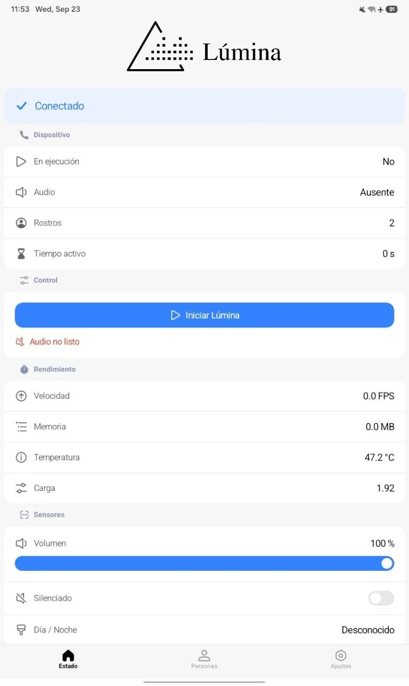

# Lúmina Companion App

> **Archived. Built for the Innovatec 2026 (InnovaTecNM) contest.**
> Lúmina was created for the **Innovatec 2026 (InnovaTecNM)** student innovation contest.
> This repository is **archived** (read-only) and preserved as the final state of the companion
> client; no further development is planned.

The phone and desktop app for **Lúmina**, an edge-AI assistive device that narrates the world
through bone-conduction audio for **blind and low-vision people**.

This app is the **companion client**: it connects to the Lúmina device (a Raspberry Pi Zero 2 W
running as a local Wi-Fi hotspot) and lets you check on it, adjust it, and enroll people it should
recognize. Everything runs **on the local network**. No cloud, no accounts, no internet.

I know the UI is not the prettiest one. We focused on functionality and, if we managed to pass to the national contest, the app was about to be redesigned. We did not, so that is why the current app looks not really user friendly.

> **Accessibility is a requirement here, not a nice-to-have.** Our users cannot see the screen, so
> every screen and control must work with a screen reader (TalkBack), use large touch targets, and
> speak its state changes in Spanish.



---

## What it does

- **Status dashboard** — is the device reachable, is the runtime running or still starting up,
  temperature, memory, FPS, volume, day/night, and the list of enrolled people.
- **Volume** — read, set, and mute the device's audio.
- **People** — see who is enrolled (even while the runtime is stopped), and add someone new.
- **Enrollment** — add a person using the **device camera** (live) or **photos from your gallery**.
- **Runtime control** — start or stop the Lúmina runtime, with a guarded toggle and graceful
  recovery if it goes down.
- **Android and Desktop (JVM)** from one shared codebase, fully tested with TalkBack.

**What it does not do:** camera preview or streaming, currency recognition, navigation, earbud
battery, detecting objects, deleting people, or anything account- or subscription-related.

## Built with

| Piece | Choice |
|-------|--------|
| Language | Kotlin Multiplatform |
| UI | Compose Multiplatform + **MiuiX** (MIUI design language) |
| Targets | Android and Desktop (JVM) |
| Sockets | Ktor `ktor-network` (raw UDP + TCP) |
| JSON | kotlinx-serialization |
| Dependency injection | Koin |
| Settings storage | multiplatform-settings |
| Build | Gradle wrapper (AGP) |

The exact pinned versions live in [`gradle/libs.versions.toml`](gradle/libs.versions.toml).

## Project structure

```
Lumina-BETA-ANDROID/
  androidApp/     Android entry point (MainActivity)
  desktopApp/      Desktop entry point (main.kt)
  shared/         All shared logic and UI (the bulk of the app)
    src/commonMain/   protocol · transport · data · ui · di
    src/androidMain/  Android-specific pieces (expect/actual)
    src/jvmMain/      Desktop-specific pieces (expect/actual)
    src/commonTest/   Unit tests
  PLAN.md         How the app was built, phase by phase
```

## Getting started

### Prerequisites

- **Android Studio** (recommended), or a JDK compatible with the Android Gradle Plugin.
- An **Android SDK** with the platform matching `compileSdk` in `libs.versions.toml`.
- **Node 18+** — only for the mock device server (see below).
- The Android SDK location is read from `local.properties` (not committed).

### Build and run

```bash
# Android app (debug)
./gradlew :androidApp:assembleDebug
# install the debug build on a connected device/emulator:
adb install -r androidApp/build/outputs/apk/debug/androidApp-debug.apk

# Desktop app (fast development loop)
./gradlew :desktopApp:run
```

### Run the tests

```bash
# Unit tests for all shared logic (fast, no device)
./gradlew :shared:allTests

# Everything
./gradlew check
```

## Connecting to a real device

1. Join the Lúmina hotspot from your phone or laptop.
2. Open the app's **Settings** and enter the gateway address and the control token.
3. The app subscribes to live telemetry over UDP and sends commands over a token-gated TCP channel.

Host, ports, and token are all configurable. The token is kept in private app storage and is never
logged or committed.

## Known limitations

Non-blocking gaps recorded at the end of the project:

- A user-selectable **Light/Dark/System** override is not implemented (the app follows the system).
- **TalkBack's hint language** ("double tap to activate") is owned by TalkBack, not the app;
  aligning it means changing the device/TalkBack language.
- The desktop view-model wiring keeps a small developer shortcut.
- `shared/androidMain` doesn't yet depend on `androidx.activity:activity-compose`; it lives in
  `androidApp` for now.

## The contest

Lúmina was built for the **Innovatec 2026 (InnovaTecNM)** contest. We reached to the **regional
stage**, but sadly we were not chosen and the project **did not advance**. This repository is
archived as the final state and as a reference; the device runtime is archived separately in
`kosail/Lumina`.

Likely, I will never work on this repository again.

## Project documents

If you want the deeper detail behind the app:

- [`docs/ACCESSIBILITY.md`](docs/ACCESSIBILITY.md) — the accessibility audit, the MIUI fallback
  register, and the manual TalkBack script.
- [`docs/VALIDATION.md`](docs/VALIDATION.md) — the end-to-end validation transcript (desktop and a
  physical Android device).
- [`docs/API_VERIFICATION.md`](docs/API_VERIFICATION.md) — how every pinned API was checked against
  its source or docs.
- [`PLAN.md`](PLAN.md) — how the app was built, phase by phase.
- [`INVARIANTS.md`](INVARIANTS.md), [`AGENTS.md`](AGENTS.md) and [`CHANGELOG.md`](CHANGELOG.md) —
  the engineering notes and rules we worked under.
- [`../Lumina-BETA-RPI-2W/docs/API_CONTRACT.md`](../Lumina-BETA-RPI-2W/docs/API_CONTRACT.md) — the
  wire protocol, owned by the runtime repository (read-only here).

The wire protocol is owned by the **runtime repository**. This app only consumes it — never change
the protocol here; changes start on the runtime side.

## Contributing

This project is **archived and no longer maintained**, so pull requests are unlikely to be
reviewed. Even so, if you're here to learn from it or to reuse parts of it, this is how we worked
on it:

1. **Read the docs first.** [`PLAN.md`](PLAN.md) explains the build, and
   [`docs/ACCESSIBILITY.md`](docs/ACCESSIBILITY.md) holds the accessibility rules. Those are hard
   requirements, not suggestions.
2. **Build and test with the Gradle wrapper only:**

   ```bash
   ./gradlew :shared:allTests :androidApp:assembleDebug
   ```

3. **Keep logic out of the UI.** Screens render state and emit events; view models own the state,
   and state is immutable.
4. **Keep user-facing text Spanish** and in string resources. Never hardcoded.
5. **Never hardcode the host, ports, or the token.**
6. **If you fork it, keep it GPLv3.**

## License

The **Lúmina projects are licensed under the GNU General Public License version 3 (GPLv3)** — see
[`LICENSE`](LICENSE).

Lúmina itself is GPLv3; **third-party dependencies keep their own licenses** and are used under
their own terms (Compose Multiplatform, Kotlin, Ktor, Koin, AndroidX/Material3, MiuiX,
multiplatform-settings, and the rest — see `gradle/libs.versions.toml`).

---

## Copyleft notice

© 2026 kosail, from the Lúmina. Lúmina is free software, licensed under the **GNU GPL v3.0 (copyleft)**. See
[`LICENSE`](LICENSE). Third-party components keep their own licenses.

With love, from Honduras. Mi país cinco estrellas.
